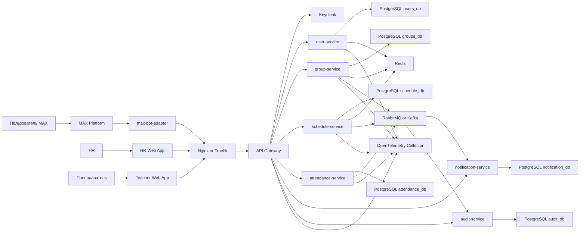
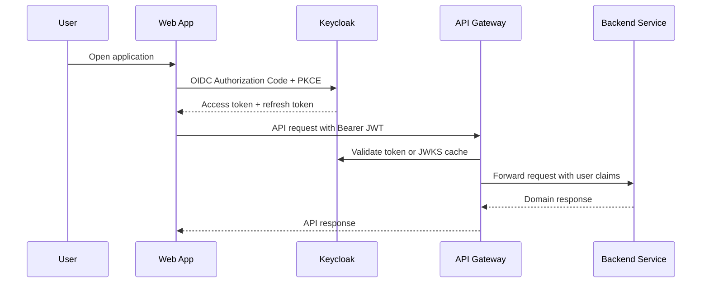
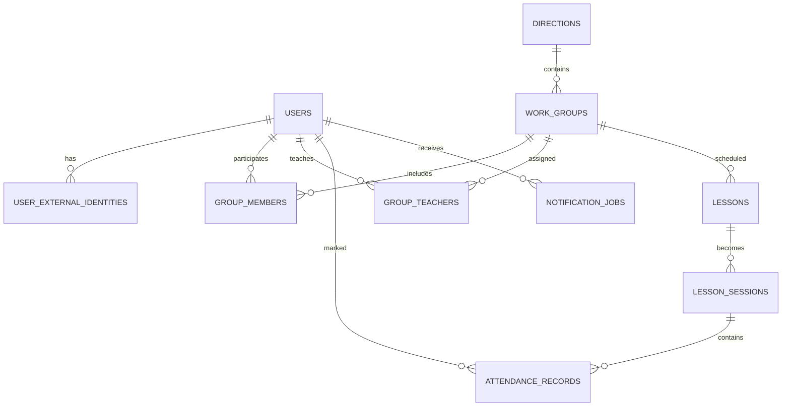
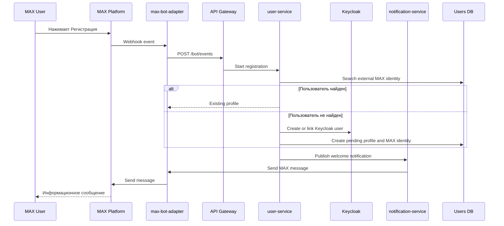
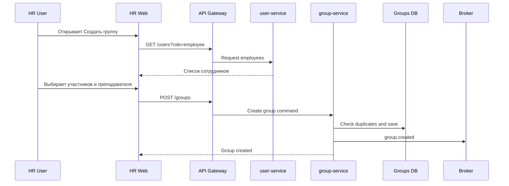
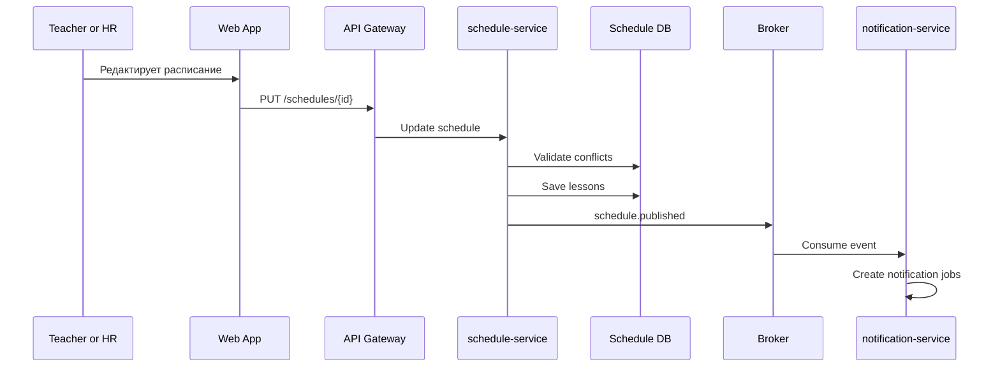
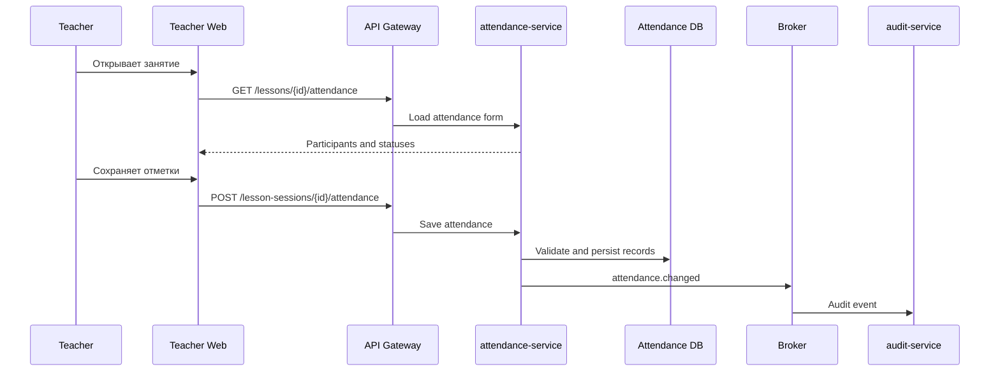

# Архитектура системы учета занятий с MAX-ботом, HR-сайтом и сайтом преподавателей

Версия: 1.0  
Дата: 09.06.2026  
Формат целевой поставки: Microsoft Word `.docx`  
Статус: проектная архитектурная документация

## 1. Назначение документа

Документ описывает целевую архитектуру системы, состоящей из MAX-бота и двух web-сайтов:

- HR-сайт для учета сотрудников, групп, направлений и организационных процессов.
- Сайт преподавателей для просмотра групп, расписания, занятий и фиксации результатов.
- MAX-бот для регистрации, уведомлений и быстрых пользовательских сценариев.

Система проектируется с учетом интеграции с Keycloak, микросервисной архитектуры и нагрузки до 10 000 пользователей. Документ не является проектом приложения и не содержит исходный код сервисов.

## 2. Бизнес-контекст

Система автоматизирует процессы, которые видны на исходных BPMN-диаграммах:

1. Регистрация пользователя через MAX-бота, выбор направления и получение информации о занятиях.
2. Создание рабочей группы администратором или HR-ролью.
3. Настройка и публикация расписания занятий.
4. Проведение занятия, проверка участников, фиксация результата и уведомление пользователя.

Ключевые участники:

| Участник | Канал | Основные действия |
|---|---|---|
| Пользователь / сотрудник | MAX-бот | Регистрация, выбор направления, получение уведомлений и информации |
| HR | HR web-сайт | Управление сотрудниками, группами, направлениями, отчетностью |
| Преподаватель | Teacher web-сайт | Просмотр групп, расписания, отметка занятий |
| Система | Backend / интеграции | Проверки, запись данных, уведомления, аудит |
| Keycloak | Auth platform | Авторизация, роли, токены, SSO |

## 3. Разбор исходных BPMN-сценариев

### 3.1. Регистрация через MAX-бота и получение информации

Сценарий начинается с нажатия пользователем кнопки регистрации в MAX-боте. Далее бот запускает процесс идентификации, пользователь выбирает направление, система проверяет данные и сохраняет результат в базе данных. После успешной обработки пользователь получает информационное сообщение.

Архитектурное соответствие:

| BPMN-шаг | Целевой компонент |
|---|---|
| Нажать кнопку регистрации | `max-bot-adapter` |
| Запуск процесса регистрации | `user-service` |
| Проверка данных пользователя | `user-service`, `identity-service`, Keycloak |
| Выбор направления | `catalog-service` или модуль справочников в `group-service` |
| Запись данных | PostgreSQL сервиса-владельца |
| Вывод сообщения в MAX | `notification-service` через `max-bot-adapter` |

### 3.2. Создание рабочей группы

Администратор или HR запускает создание рабочей группы, выбирает сотрудников из выпадающего списка, редактирует параметры группы, сохраняет данные. Система проверяет дубли и записывает информацию в базу. После сохранения отображается информационное сообщение.

Архитектурное соответствие:

| BPMN-шаг | Целевой компонент |
|---|---|
| Открыть форму создания группы | HR web frontend |
| Получить список сотрудников | `user-service` |
| Выбрать сотрудников и преподавателя | HR web frontend, `group-service` |
| Проверка дублей | `group-service` |
| Запись группы и состава | `group-service` PostgreSQL |
| Информационное сообщение | frontend notification + audit event |

### 3.3. Расписание занятий

Пользователь выбирает рабочую группу, система показывает данные по группе, затем открывается панель расписания. После редактирования расписание сохраняется, система проверяет дубли и записывает данные в базу.

Архитектурное соответствие:

| BPMN-шаг | Целевой компонент |
|---|---|
| Выбрать рабочую группу | Teacher web frontend или HR web frontend |
| Получить информацию о группе | `group-service` |
| Открыть расписание | `schedule-service` |
| Изменить расписание | `schedule-service` |
| Проверка дублей и конфликтов | `schedule-service` |
| Сохранение | `schedule-service` PostgreSQL |
| Уведомления участникам | `notification-service` через брокер |

### 3.4. Проведение занятия и учет

В процессе занятия система использует расписание, группу, преподавателя и участников. Преподаватель фиксирует факт проведения, посещаемость или статус занятия. После проверки данных результат сохраняется, а пользователь получает уведомление.

Архитектурное соответствие:

| BPMN-шаг | Целевой компонент |
|---|---|
| Открыть занятие | Teacher web frontend |
| Получить расписание и группу | `schedule-service`, `group-service` |
| Отметить результат | `attendance-service` |
| Проверить корректность | `attendance-service` |
| Записать факт занятия | `attendance-service` PostgreSQL |
| Отправить уведомления | `notification-service` |
| Записать историю изменений | `audit-service` |

## 4. Архитектурные принципы

1. Backend-сервисы разрабатываются на Python 3.12+ и FastAPI.
2. Авторизация и SSO централизованы в Keycloak.
3. Внешний доступ идет только через API Gateway / reverse proxy.
4. Сервисы stateless и масштабируются горизонтально.
5. Каждый микросервис владеет своей БД или отдельной PostgreSQL-схемой.
6. Межсервисные связи строятся через API и события, а не через прямой доступ к чужим таблицам.
7. Долгие операции, уведомления и синхронизации выполняются асинхронно через брокер сообщений.
8. Все критичные действия логируются в audit trail.
9. Система должна иметь мониторинг, трассировку, централизованные логи и алерты.
10. Сначала рекомендуется реализовать modular monolith или малое число сервисов, но с границами, совместимыми с будущей микросервисной декомпозицией. Для документации ниже описана целевая микросервисная модель.

## 5. Целевая микросервисная архитектура

## 6. Компоненты и зоны ответственности

| Компонент | Назначение | Технологии |
|---|---|---|
| HR Web App | Интерфейс HR, группы, сотрудники, справочники, отчеты | React, TypeScript, Vite, TanStack Query |
| Teacher Web App | Интерфейс преподавателя, расписание, занятия, отметки | React, TypeScript, Vite, TanStack Query |
| API Gateway | Единая точка входа, маршрутизация, rate limiting, проверка JWT | Kong, Traefik, Nginx, Envoy или FastAPI gateway |
| Keycloak | SSO, OAuth2/OIDC, роли, клиенты, пользователи | Keycloak 25+ |
| max-bot-adapter | Интеграция с MAX API, webhooks, команды бота | FastAPI, httpx |
| user-service | Профили, сотрудники, преподаватели, MAX ID, связь с Keycloak | FastAPI, PostgreSQL |
| group-service | Рабочие группы, составы, направления, назначение преподавателей | FastAPI, PostgreSQL |
| schedule-service | Расписание, занятия, конфликты времени, публикация | FastAPI, PostgreSQL |
| attendance-service | Факт занятий, посещаемость, статусы, подтверждения | FastAPI, PostgreSQL |
| notification-service | Уведомления в MAX, email, статусы доставки | FastAPI workers, RabbitMQ/Kafka |
| audit-service | Журнал действий, безопасность, расследование инцидентов | FastAPI, PostgreSQL, append-only модель |
| Redis | Кэш, rate limits, короткоживущие состояния | Redis Cluster |
| Broker | События и фоновые задачи | RabbitMQ или Kafka |
| Observability | Метрики, логи, трассировка | OpenTelemetry, Prometheus, Grafana, Loki |

## 7. Порты и сетевые контуры

| Сервис | Внешний порт | Внутренний порт | Протокол | Доступ |
|---|---:|---:|---|---|
| Nginx / Traefik | 443 | 443 | HTTPS | Internet / intranet |
| API Gateway | - | 8000 | HTTP/REST | Только через reverse proxy |
| Keycloak | 443 или 8443 | 8080 | HTTPS/HTTP | Через reverse proxy |
| max-bot-adapter | - | 8010 | HTTP webhook | Только gateway / MAX allowlist |
| user-service | - | 8020 | HTTP/REST | Внутренняя сеть |
| group-service | - | 8030 | HTTP/REST | Внутренняя сеть |
| schedule-service | - | 8040 | HTTP/REST | Внутренняя сеть |
| attendance-service | - | 8050 | HTTP/REST | Внутренняя сеть |
| notification-service | - | 8060 | HTTP/REST + workers | Внутренняя сеть |
| audit-service | - | 8070 | HTTP/REST | Внутренняя сеть |
| PostgreSQL | - | 5432 | TCP | Только backend-сервисы |
| PgBouncer | - | 6432 | TCP | Backend -> PostgreSQL |
| Redis | - | 6379 | TCP | Backend-сервисы |
| RabbitMQ | - | 5672 | AMQP | Backend-сервисы |
| RabbitMQ Management | - | 15672 | HTTPS | Только администраторы/VPN |
| Kafka | - | 9092 | TCP | Backend-сервисы |
| Prometheus | - | 9090 | HTTP | Ops network |
| Grafana | 443 | 3000 | HTTPS/HTTP | Ops / admins |

Рекомендуется закрыть все внутренние порты firewall-правилами, Kubernetes NetworkPolicy или настройками облачной сети. Из внешней сети должны быть доступны только web-приложения, API Gateway и Keycloak через reverse proxy.

## 8. Авторизация и Keycloak

### 8.1. Realm и клиенты

Предлагаемый realm: `max-education`.

Клиенты Keycloak:

| Client ID | Тип клиента | Назначение |
|---|---|---|
| `hr-web` | Public + PKCE | Авторизация HR web-сайта |
| `teacher-web` | Public + PKCE | Авторизация сайта преподавателя |
| `api-gateway` | Confidential | Проверка токенов и service-to-service запросы |
| `max-bot-adapter` | Confidential | Технический клиент для bot backend |
| `internal-services` | Confidential | Service account для внутренних интеграций |

### 8.2. Роли

| Роль | Описание |
|---|---|
| `admin` | Полный доступ к настройкам и справочникам |
| `hr_manager` | Управление сотрудниками, группами, отчетами |
| `teacher` | Доступ к своим группам, расписанию и занятиям |
| `student` или `employee` | Получение информации, регистрация, уведомления |
| `auditor` | Только чтение журналов и отчетов |
| `service_account` | Внутрисервисные операции |

### 8.3. Поток авторизации web-сайтов

### 8.4. Связь MAX-пользователя и Keycloak

MAX-пользователь может не иметь интерактивной web-сессии. Для связи используется таблица `user_external_identity`, где хранятся `provider = 'max'`, `external_user_id`, `keycloak_user_id` и статус верификации.

Для первичной регистрации возможны два подхода:

1. Пользователь открывает одноразовую ссылку из бота и проходит авторизацию в Keycloak.
2. Пользователь регистрируется через бот, а система создает профиль в состоянии `pending_verification`, затем HR подтверждает или связывает его с существующим сотрудником.

Рекомендуемый вариант: для сотрудников использовать подтверждение через Keycloak или HR, чтобы исключить подмену личности.

## 9. Модель данных и базы

### 9.1. Общий подход

Для production-нагрузки лучше использовать PostgreSQL как основную транзакционную БД. На старте можно развернуть один PostgreSQL-кластер с отдельными схемами на сервис, а затем при росте нагрузки вынести наиболее нагруженные домены в отдельные базы.

Правила:

- Каждый сервис изменяет только свои таблицы.
- Другие сервисы обращаются к данным через API или события.
- Внешние ключи между базами разных сервисов не используются.
- Межсервисные связи хранятся как UUID-ссылки.
- Для отчетов используются read-модели или отдельное хранилище аналитики.

### 9.2. Users DB

Основные таблицы:

| Таблица | Назначение | Ключевые поля |
|---|---|---|
| `users` | Локальный профиль пользователя | `id`, `keycloak_user_id`, `status`, `created_at` |
| `employee_profiles` | HR-данные сотрудника | `user_id`, `full_name`, `department`, `position`, `phone` |
| `teacher_profiles` | Профиль преподавателя | `user_id`, `specialization`, `active` |
| `user_external_identities` | Связь с MAX и другими системами | `user_id`, `provider`, `external_user_id`, `verified_at` |
| `user_roles_cache` | Кэш ролей для быстрых проверок | `user_id`, `role`, `source`, `expires_at` |

Связи:

- `users.id` 1:1 `employee_profiles.user_id`
- `users.id` 1:1 `teacher_profiles.user_id`
- `users.id` 1:N `user_external_identities.user_id`
- `users.keycloak_user_id` ссылается логически на пользователя в Keycloak

### 9.3. Groups DB

Основные таблицы:

| Таблица | Назначение | Ключевые поля |
|---|---|---|
| `directions` | Направления обучения/работы | `id`, `name`, `description`, `active` |
| `work_groups` | Рабочие группы | `id`, `direction_id`, `name`, `status`, `created_by` |
| `group_members` | Участники группы | `group_id`, `user_id`, `member_status`, `joined_at` |
| `group_teachers` | Преподаватели группы | `group_id`, `teacher_user_id`, `role` |
| `group_history` | История изменений состава | `id`, `group_id`, `action`, `payload`, `created_at` |

Связи:

- `directions.id` 1:N `work_groups.direction_id`
- `work_groups.id` 1:N `group_members.group_id`
- `work_groups.id` 1:N `group_teachers.group_id`
- `group_members.user_id` логически связан с `users.id`
- `group_teachers.teacher_user_id` логически связан с `users.id`

### 9.4. Schedule DB

Основные таблицы:

| Таблица | Назначение | Ключевые поля |
|---|---|---|
| `schedules` | Расписание группы | `id`, `group_id`, `status`, `timezone` |
| `lessons` | Конкретные занятия | `id`, `schedule_id`, `group_id`, `teacher_user_id`, `starts_at`, `ends_at`, `status` |
| `lesson_locations` | Место или online-ссылка | `lesson_id`, `type`, `address`, `url` |
| `schedule_conflicts` | Найденные конфликты | `id`, `lesson_id`, `conflict_type`, `resolved_at` |

Ключевые индексы:

- `lessons(group_id, starts_at)`
- `lessons(teacher_user_id, starts_at)`
- `lessons(status, starts_at)`
- exclusion constraint или проверка пересечений времени для предотвращения дублей

### 9.5. Attendance DB

Основные таблицы:

| Таблица | Назначение | Ключевые поля |
|---|---|---|
| `lesson_sessions` | Факт проведения занятия | `id`, `lesson_id`, `started_at`, `finished_at`, `status` |
| `attendance_records` | Отметки участников | `session_id`, `user_id`, `status`, `marked_by`, `marked_at` |
| `lesson_results` | Итоговые данные занятия | `session_id`, `summary`, `homework`, `materials_url` |
| `attendance_change_log` | История изменений отметок | `id`, `record_id`, `old_status`, `new_status`, `changed_by` |

Статусы посещаемости:

- `present`
- `absent`
- `late`
- `excused`
- `unknown`

### 9.6. Notifications DB

Основные таблицы:

| Таблица | Назначение | Ключевые поля |
|---|---|---|
| `notification_templates` | Шаблоны сообщений | `id`, `code`, `channel`, `body` |
| `notification_jobs` | Задания на отправку | `id`, `recipient_user_id`, `channel`, `payload`, `status` |
| `notification_deliveries` | Попытки доставки | `job_id`, `provider`, `external_message_id`, `status`, `error` |

### 9.7. Audit DB

Основные таблицы:

| Таблица | Назначение | Ключевые поля |
|---|---|---|
| `audit_events` | Журнал действий | `id`, `actor_user_id`, `action`, `entity_type`, `entity_id`, `created_at` |
| `security_events` | События безопасности | `id`, `event_type`, `ip`, `user_agent`, `created_at` |

Audit-таблицы рекомендуется делать append-only: записи не обновляются и не удаляются обычными бизнес-операциями.

## 10. Связи между доменами

Важно: диаграмма показывает логические связи. В микросервисной реализации физические foreign keys между базами разных сервисов не создаются.

## 11. Событийная модель

Для асинхронного взаимодействия рекомендуется использовать события.

| Событие | Источник | Получатели | Назначение |
|---|---|---|---|
| `user.registered` | `user-service` | `notification-service`, `audit-service` | Приветствие, аудит |
| `user.max_identity_linked` | `user-service` | `notification-service` | Подтверждение привязки MAX |
| `group.created` | `group-service` | `notification-service`, `audit-service` | Уведомление участников |
| `group.member_added` | `group-service` | `notification-service`, `schedule-service` | Уведомления, обновление read-моделей |
| `schedule.published` | `schedule-service` | `notification-service` | Рассылка расписания |
| `lesson.updated` | `schedule-service` | `notification-service`, `attendance-service` | Обновление занятия |
| `lesson.completed` | `attendance-service` | `notification-service`, `audit-service` | Итоги занятия |
| `attendance.changed` | `attendance-service` | `audit-service` | История изменений |

Для 10 000 пользователей достаточно RabbitMQ, если основная нагрузка связана с уведомлениями и бизнес-событиями. Kafka стоит выбирать, если планируются большие потоки событий, аналитика, replay событий и несколько независимых consumer-групп.

## 12. Потоки данных

### 12.1. Регистрация через MAX-бота

### 12.2. Создание рабочей группы

### 12.3. Публикация расписания

### 12.4. Учет занятия

## 13. API-контракты верхнего уровня

| Endpoint | Метод | Сервис | Назначение |
|---|---|---|---|
| `/api/v1/bot/events` | POST | `max-bot-adapter` | Прием событий от MAX |
| `/api/v1/users/me` | GET | `user-service` | Текущий профиль |
| `/api/v1/users` | GET | `user-service` | Список пользователей для HR |
| `/api/v1/groups` | GET/POST | `group-service` | Получение и создание групп |
| `/api/v1/groups/{id}/members` | GET/POST | `group-service` | Участники группы |
| `/api/v1/schedules` | GET/POST | `schedule-service` | Расписания |
| `/api/v1/lessons/{id}` | GET/PUT | `schedule-service` | Карточка занятия |
| `/api/v1/lessons/{id}/attendance` | GET/POST | `attendance-service` | Посещаемость |
| `/api/v1/notifications/jobs` | GET | `notification-service` | Статусы уведомлений |
| `/api/v1/audit/events` | GET | `audit-service` | Журнал действий |

Все внешние API должны быть доступны только через Gateway и проверять JWT. Внутренние API дополнительно защищаются mTLS или service tokens.

## 14. Масштабирование на 10 000 пользователей

### 14.1. Расчетная нагрузка

10 000 пользователей не означает 10 000 одновременных запросов. Для проектирования нужно учитывать сценарии:

- Утренний пик входа и просмотра расписания.
- Массовая рассылка уведомлений.
- Одновременная отметка занятий преподавателями.
- HR-операции по группам и отчетам.
- Периодические фоновые задачи.

Рекомендуемые стартовые ориентиры:

| Слой | Стартовая конфигурация | Масштабирование |
|---|---|---|
| API Gateway | 2 replicas | HPA по RPS/CPU |
| FastAPI service | 2-3 replicas на сервис | HPA по CPU, latency, queue depth |
| PostgreSQL | Primary + replica | Read replicas, partitioning, PgBouncer |
| Redis | 3 nodes | Redis Sentinel или Cluster |
| RabbitMQ | 3 nodes | Quorum queues |
| Observability | отдельный контур | Retention и sampling |

### 14.2. Backend

Для FastAPI:

- Запуск через `gunicorn` + `uvicorn-worker` или нативный `uvicorn` в контейнере.
- 2-4 worker-процесса на pod в зависимости от CPU.
- Асинхронные DB-драйверы и HTTP-клиенты.
- Таймауты на все внешние вызовы.
- Idempotency keys для повторных команд от MAX и frontend.
- Pagination и фильтры для списков.
- Background jobs не выполнять в web worker-процессах, а выносить в отдельные worker pods.

### 14.3. PostgreSQL

Рекомендации:

- UUID primary keys.
- Индексы по внешним идентификаторам, датам, статусам.
- PgBouncer для контроля количества соединений.
- Read replicas для отчетов.
- Partitioning для `audit_events`, `notification_deliveries`, `attendance_change_log`.
- Регулярный VACUUM/ANALYZE.
- Backups + point-in-time recovery.

### 14.4. Redis

Использование:

- Кэш JWKS Keycloak.
- Кэш справочников и расписания.
- Rate limiting.
- Короткоживущие состояния bot-сценариев.
- Distributed locks для редких операций, где нужна защита от дублей.

Не хранить в Redis единственный экземпляр критичных бизнес-данных.

### 14.5. Брокер сообщений

RabbitMQ подходит для:

- Очередей уведомлений.
- Retry и dead-letter queues.
- Команд на фоновые операции.

Kafka подходит для:

- Event streaming.
- Аналитики.
- Replay событий.
- Большого количества consumers.

Для первого production-релиза рекомендуется RabbitMQ, если нет отдельного требования к потоковой аналитике.

## 15. Отказоустойчивость

| Риск | Механизм защиты |
|---|---|
| MAX API временно недоступен | Retry с backoff, DLQ, повторная отправка |
| Keycloak недоступен | Кэш JWKS, короткая деградация только для уже выданных JWT |
| PostgreSQL перегружен | PgBouncer, индексы, лимиты запросов, read replicas |
| Дубли webhook-событий | Idempotency table по external event ID |
| Ошибки уведомлений | `notification_deliveries`, retry policy, DLQ |
| Массовая рассылка создает пик | Очереди, throttling, батчинг |
| Ошибочные изменения данных | Audit trail, soft delete для бизнес-сущностей |

## 16. Наблюдаемость

Минимальный production-набор:

- OpenTelemetry SDK во всех FastAPI-сервисах.
- OpenTelemetry Collector.
- Prometheus для метрик.
- Grafana для dashboard.
- Loki или ELK/OpenSearch для логов.
- Sentry для ошибок frontend/backend.
- Alertmanager для алертов.

Ключевые метрики:

| Метрика | Назначение |
|---|---|
| `http_requests_total` | RPS по сервисам |
| `http_request_duration_seconds` | p95/p99 latency |
| `db_query_duration_seconds` | Медленные запросы |
| `queue_depth` | Накопление задач |
| `notification_delivery_failures_total` | Ошибки доставки |
| `keycloak_token_validation_errors_total` | Проблемы авторизации |
| `bot_webhook_duplicates_total` | Дубли событий MAX |

## 17. Безопасность

Рекомендации:

- TLS для всего внешнего трафика.
- JWT validation на Gateway и проверка прав в сервисах.
- RBAC через Keycloak roles + domain-level permissions.
- PKCE для frontend-клиентов.
- Service accounts для backend-to-backend.
- mTLS внутри кластера при повышенных требованиях.
- Secrets хранить в Kubernetes Secrets, Vault или облачном Secret Manager.
- Audit для изменения групп, расписаний, посещаемости и ролей.
- Rate limiting на login, bot webhook и публичные endpoint.
- CORS только для разрешенных доменов.
- Защита от replay webhook-событий через подпись, timestamp и idempotency.

## 18. Технологический стек

### 18.1. Backend

| Область | Рекомендуемые технологии |
|---|---|
| Framework | Python 3.12+, FastAPI |
| ASGI server | Uvicorn, Gunicorn, uvicorn-worker |
| Validation | Pydantic v2 |
| ORM | SQLAlchemy 2.0 async |
| Migrations | Alembic |
| PostgreSQL driver | asyncpg |
| HTTP client | httpx |
| Auth | python-jose или PyJWT, authlib |
| Settings | pydantic-settings |
| Background jobs | Celery, Dramatiq или arq |
| Messaging | aio-pika для RabbitMQ, aiokafka для Kafka |
| Cache | redis-py asyncio |
| Observability | opentelemetry-python, prometheus-client, structlog |
| Tests | pytest, pytest-asyncio, httpx AsyncClient, testcontainers |

### 18.2. Frontend

| Область | Рекомендуемые технологии |
|---|---|
| Framework | React 18+ |
| Language | TypeScript |
| Build | Vite |
| Routing | TanStack Router или React Router |
| Server state | TanStack Query |
| Forms | React Hook Form |
| Validation | Zod |
| UI | MUI, Ant Design или shadcn/ui |
| Auth | keycloak-js или oidc-client-ts |
| Tests | Vitest, Playwright |

### 18.3. Infrastructure

| Область | Рекомендуемые технологии |
|---|---|
| Containers | Docker |
| Orchestration | Kubernetes |
| Ingress | Nginx Ingress, Traefik или Envoy Gateway |
| IaC | Terraform, Helm |
| CI/CD | GitHub Actions, GitLab CI или TeamCity |
| DB | PostgreSQL 16+ |
| Pooling | PgBouncer |
| Cache | Redis 7+ |
| Broker | RabbitMQ 3.13+ или Kafka |
| Observability | OpenTelemetry, Prometheus, Grafana, Loki |

## 19. Список библиотек

### 19.1. Python/FastAPI

| Библиотека | Назначение |
|---|---|
| `fastapi` | Web API |
| `uvicorn` | ASGI server |
| `gunicorn` | Process manager для Linux production |
| `pydantic` | DTO и validation |
| `pydantic-settings` | Конфигурация |
| `sqlalchemy[asyncio]` | ORM и SQL layer |
| `asyncpg` | PostgreSQL async driver |
| `alembic` | Миграции |
| `httpx` | Внешние HTTP-запросы |
| `PyJWT` или `python-jose` | JWT validation |
| `authlib` | OAuth2/OIDC интеграции |
| `redis` | Redis async client |
| `aio-pika` | RabbitMQ async client |
| `aiokafka` | Kafka client, если выбран Kafka |
| `celery` | Фоновые задачи, если выбран Celery |
| `dramatiq` | Альтернатива Celery |
| `structlog` | Структурированные логи |
| `opentelemetry-api` | Трассировка |
| `opentelemetry-sdk` | SDK трассировки |
| `opentelemetry-instrumentation-fastapi` | Автоинструментация FastAPI |
| `opentelemetry-instrumentation-sqlalchemy` | Трассировка SQL |
| `prometheus-client` | Метрики |
| `sentry-sdk` | Error tracking |
| `tenacity` | Retry с backoff |
| `orjson` | Быстрая JSON-сериализация |
| `pytest` | Тесты |
| `pytest-asyncio` | Async-тесты |
| `testcontainers` | Интеграционные тесты с контейнерами |

### 19.2. Frontend

| Библиотека | Назначение |
|---|---|
| `react` | UI |
| `typescript` | Типизация |
| `vite` | Сборка |
| `@tanstack/react-query` | Server state |
| `@tanstack/router` или `react-router-dom` | Routing |
| `react-hook-form` | Формы |
| `zod` | Validation |
| `oidc-client-ts` | OIDC login |
| `keycloak-js` | Прямая интеграция с Keycloak |
| `axios` или `ky` | HTTP client |
| `date-fns` | Работа с датами |
| `@sentry/react` | Error tracking |
| `vitest` | Unit tests |
| `playwright` | E2E tests |

### 19.3. Keycloak и безопасность

| Инструмент | Назначение |
|---|---|
| Keycloak | Identity provider |
| Keycloak Operator | Kubernetes deployment |
| cert-manager | TLS certificates |
| External Secrets Operator | Secrets integration |
| HashiCorp Vault | Централизованное хранение секретов |
| OWASP ZAP | Security testing |

## 20. Рекомендации по реализации этапами

### Этап 1. Архитектурный MVP

- Keycloak realm, клиенты и роли.
- HR web: сотрудники, группы.
- Teacher web: группы и расписание.
- MAX-бот: регистрация и уведомления.
- FastAPI backend с модульными границами.
- PostgreSQL, Redis, RabbitMQ.

### Этап 2. Production hardening

- Разделение сервисов по доменам.
- Observability.
- Audit.
- Retry/DLQ для уведомлений.
- Нагрузочное тестирование.
- CI/CD и окружения dev/stage/prod.

### Этап 3. Масштабирование

- Kubernetes HPA.
- Read replicas.
- Partitioning больших таблиц.
- Отдельная аналитическая read-модель.
- Kafka, если появится потребность в event streaming.

## 21. Риски и открытые решения

| Вопрос | Рекомендация |
|---|---|
| RabbitMQ или Kafka | Начать с RabbitMQ, перейти к Kafka при необходимости event streaming |
| Один PostgreSQL или несколько | Начать с одного кластера и отдельных схем, сохранить границы владения |
| Микросервисы сразу или постепенно | Начать с малого числа сервисов, но документировать границы доменов |
| Связь MAX и Keycloak | Использовать подтверждение личности через Keycloak или HR |
| Отчеты | Не нагружать транзакционные таблицы, делать read-модели |

## 22. Итоговая рекомендация

Для заданной системы оптимальна архитектура с FastAPI-сервисами, Keycloak как единой системой идентификации, PostgreSQL как основной транзакционной БД, Redis для кэша и rate limiting, RabbitMQ для фоновых событий и уведомлений, а также полноценной наблюдаемостью через OpenTelemetry, Prometheus, Grafana и Loki.

При нагрузке до 10 000 пользователей критично не количество микросервисов, а правильные границы данных, отсутствие синхронных тяжелых цепочек, устойчивые очереди уведомлений, индексы в PostgreSQL, connection pooling и горизонтальное масштабирование stateless-компонентов.
