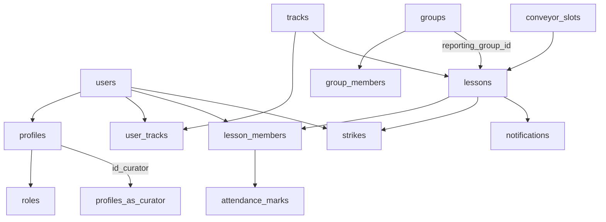

# MAX RASS — целевая модель БД

## Что поменялось

Платформа переходит от схемы, где обучение строится вокруг рабочих групп, к схеме с треками и конвейерными слотами.

- `groups` остаются для отчётности, потоков, наборов и HR-фильтров.
- `tracks` описывают учебные треки: например, бетонщик, арматурщик, водитель бетономешалки.
- `user_tracks` хранит параллельные треки пользователя.
- `conveyor_slots` хранит фиксированные слоты занятий.
- `lessons` теперь может ссылаться на `track_id`, `slot_id` и `reporting_group_id`.
- `lesson_members.role_in_lesson` позволяет отмечать на занятии не только учеников, но и преподавателя.
- `attendance_marks.subject_role` и `marked_by_role` фиксируют, кого отметили и кто отметил.
- `strikes.target_role` сохраняет роль получателя страйка.

## Основные правила

- Веб-платформа предназначена для HR.
- HR создаёт занятия, отмечает посещаемость учеников и преподавателей, выписывает страйки.
- Ученики, преподаватели и кураторы работают через MAX.
- Куратор видит только своих подопечных: `profiles.id_curator = curator_user_id`.
- У пользователя может быть несколько активных треков одновременно.
- Группы не удаляются, но больше не являются обязательной учебной осью.
- Преподавательские страйки не блокируют аккаунт.
- Автоблок после 3 активных страйков применяется только к роли `employee`.

## Ключевые связи

## Совместимость

Старое поле `lessons.group_id` сохранено на переходный период. Новая отчётная связь хранится в `lessons.reporting_group_id`; при миграции она заполняется из `group_id`.

Старые отчёты и HR UI продолжают использовать группы, но backend уже может создавать и показывать занятия с треком и слотом.
